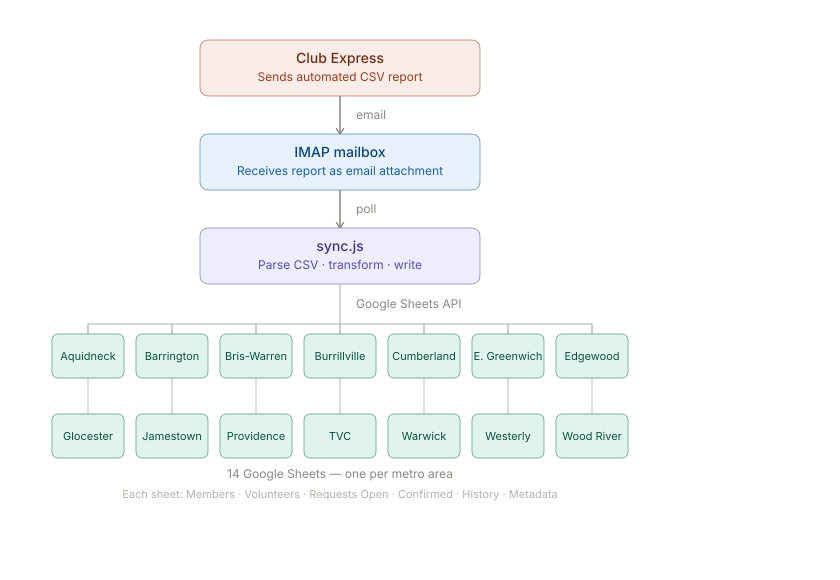

# CE Sheets Sync

An automated data pipeline that pulls membership, volunteer and service request data from Club Express and synchronizes it to Google Sheets for each TVCRI Village (metro area).

## How It Works



The robot runs as a scheduled cron job (typically hourly). It polls an IMAP email inbox, waits for a Club Express membership report, parses the CSV, and updates 14 Google Sheets—one per metro area—with the latest member and volunteer information.

## Getting Started

- **[Setup Guide](docs/SETUP.md)** — Installation and running manually
- **[Environment Variables](docs/ENV-VARIABLES.md)** — Detailed `.env` configuration reference
- **[Scheduling Guide](docs/SCHEDULING.md)** — Set up automatic runs (cron on Linux/macOS, Task Scheduler on Windows)
- **[Google OAuth Setup](docs/GOOGLE-OAUTH.md)** — Configure Google Sheets access
- **[Troubleshooting](docs/TROUBLESHOOTING.md)** — Common issues and solutions

## Quick Start

```bash
git clone <repo-url> ce-sheets-sync
cd ce-sheets-sync
npm install
cp .env.example .env
# Edit .env with your settings (email, Google OAuth credentials)
node sync.js
```

The robot will poll the email inbox for up to 55 minutes total: checks every 30 seconds for the first 5 minutes (fast phase), then every 60 seconds for the remaining 50 minutes (slow phase). If it finds a new Club Express report, it processes it and exits.

## Metro Areas

The robot syncs to 14 Google Sheets, one per metro area:

| Metro Area     | Status |
|----------------|--------|
| Aquidneck      | ✓      |
| Barrington     | ✓      |
| Bristol-Warren | ✓      |
| Burrillville   | ✓      |
| Cumberland     | ✓      |
| East Greenwich | ✓      |
| Edgewood       | ✓      |
| Glocester      | ✓      |
| Jamestown      | ✓      |
| Providence     | ✓      |
| TVC            | ✓      |
| Warwick        | ✓      |
| Westerly       | ✓      |
| Wood River     | ✓      |

### What Gets Synced

Each sheet has 5 tabs:

- **Members** — Name, Phone, Email, Address, Birthday, Emergency Contact, Join Date
- **Volunteers** — Name, Phone, Email, Address, Categories (Errands, Rides, Tech Support, Home Help)
- **Requests Open** — Service requests waiting for a volunteer to accept
- **Requests Confirmed** — Requests assigned to a volunteer, in progress
- **Requests History** — Completed or cancelled requests

Plus a **Metadata** tab with timestamps and analytics (volunteer activity, member request activity, service counts).

## For Developers

**Test suite:**

```bash
npm test
```

This runs all tests in `test/` using Node.js built-in test runner.

**Manual debugging:**

```bash
# Process a local CSV file
CSV_FILE=scratch/dump-chain.csv node sync.js 2>&1 | grep '"level":"error"'

# Sync only one metro area
METRO_AREAS="Aquidneck" node sync.js

# Increase verbosity (coming in a future version)
DEBUG=* node sync.js
```

## Architecture

**Key files:**

- `sync.js` — Main entry point (IMAP polling, CSV processing, orchestration)
- `lib/dump-chain-processor.js` — CSV parsing and data transformation (pure functions, fully tested)
- `lib/sheets-sync.js` — Google Sheets API write layer
- `lib/metro-areas.js` — Metro area → Google Sheet ID mapping
- `lib/logger.js` — Structured JSON logging

**Club Express Report Definitions:**

- `setup/ce/` — XML configuration files that define the automated reports in Club Express. These are exported from Club Express and uploaded back into the platform to configure what data is included in each email dump. They define the multi-section CSV structure that this robot parses.

**No build step.** This is plain Node.js ESM — just run it.

---

**Last updated:** May 2026
